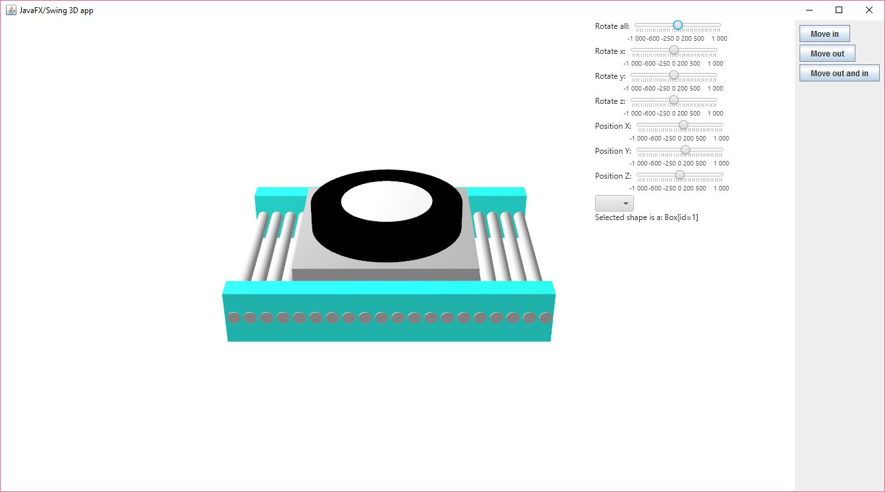
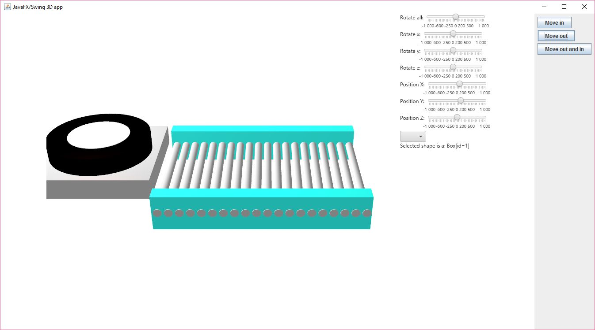
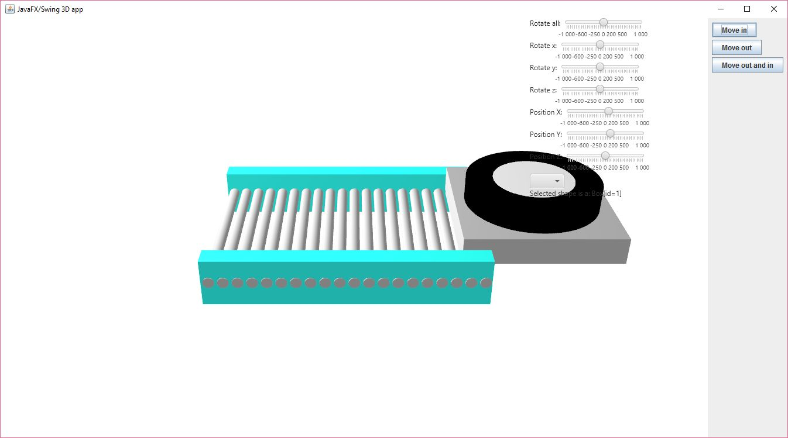
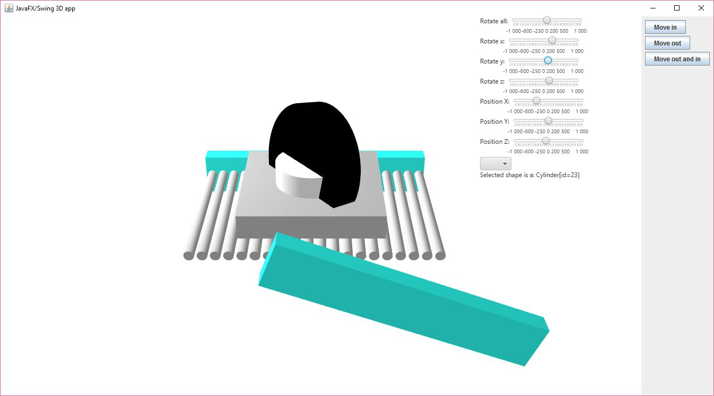

# JavaFx3DApp
A simple 3D model made in JavaFX that is compatible with swing.

The focus is the class ThreeDeePanel.java that is just an extended JPanel with some JavaFX 3d modeling in it that displays a 3-Dimensional conveyor with a pallet on it.

You can add this to any swing or awt layout JPanel and control its functions with the methods MovePalletIn() MovePalletOut() to animate the pallet displayed on the conveyor.

You can look into the MainFrame.java for example.

