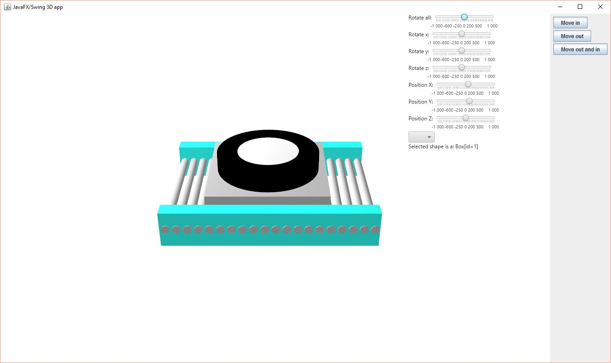
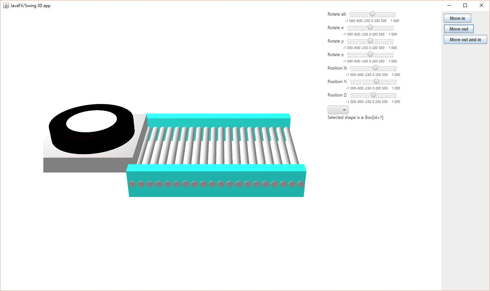
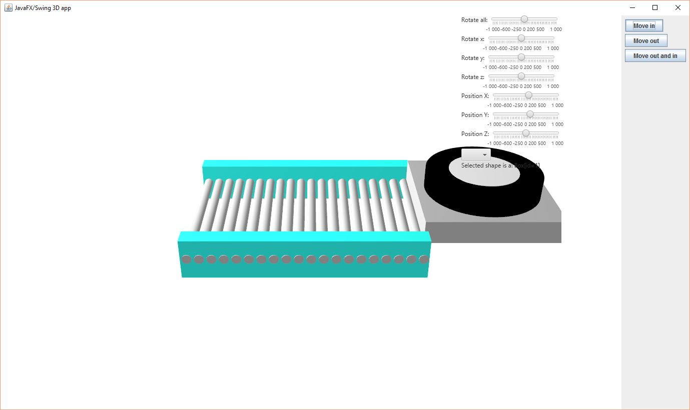

# JavaFx3DApp
A simple 3D model made in JavaFX that is compatible with swing. The main purpose is to demonstrate 3d capabilities in swing.

The focus is the class ThreeDeePanel.java that is just an extended JPanel with some JavaFX 3d modeling in it that displays a (very rough) 3-Dimensional conveyor with a pallet on it.

You can add this to any swing or awt layout JPanel and control its functions with the methods MovePalletIn() MovePalletOut() to animate the pallet displayed on the conveyor.

You can look into the MainFrame.java for example.

static image

moving out

moving in

You can click a 3d node and manipulate it with the sliders if you for some reason like to

